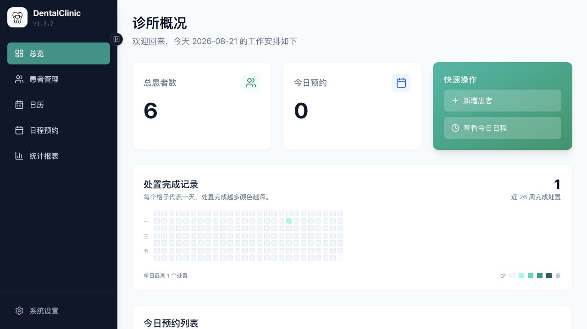
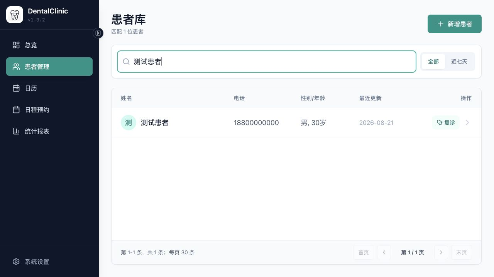
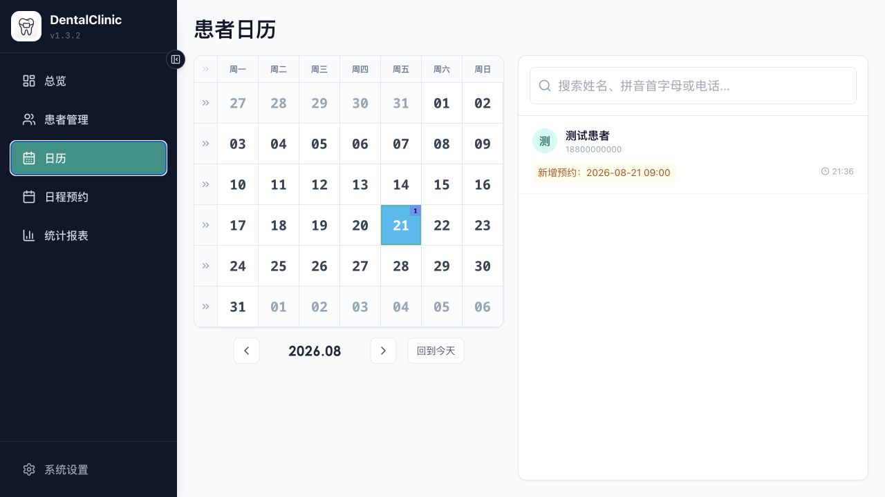
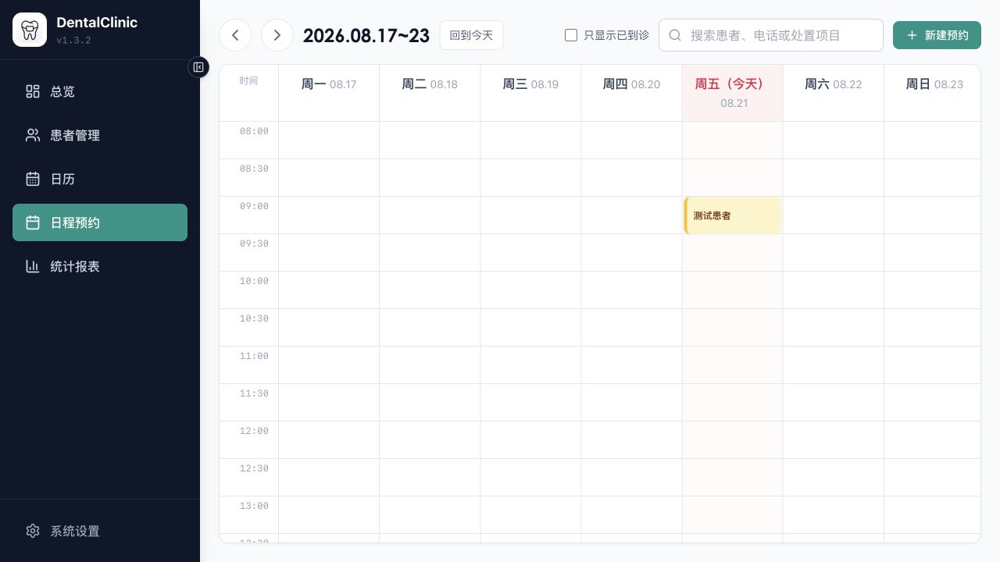
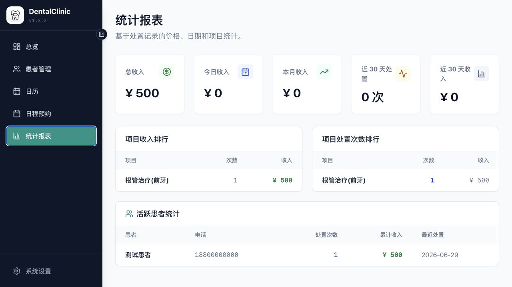
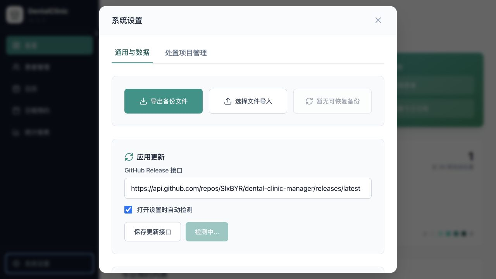
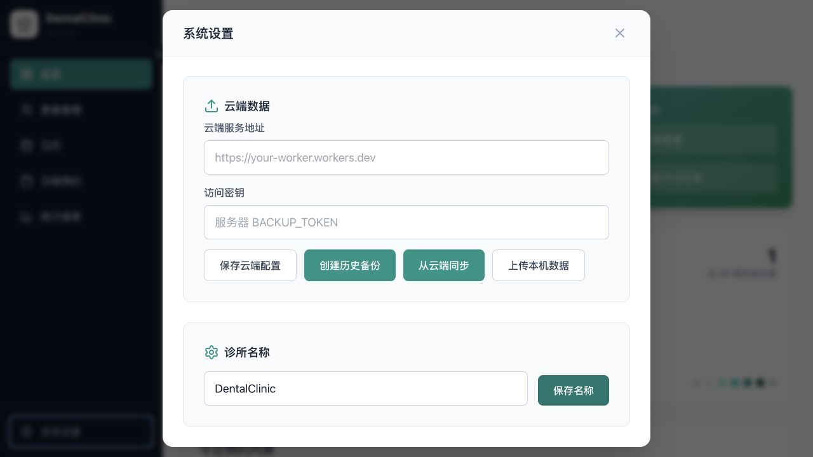
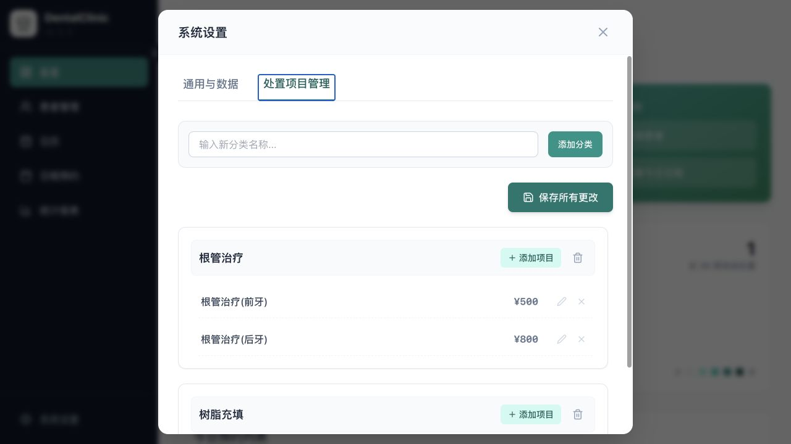
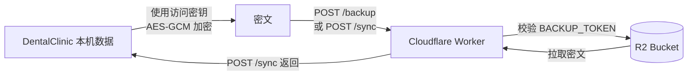

# DentalClinic 口腔诊所管理系统

DentalClinic 是一款面向小型口腔诊所的本地桌面应用，集中管理患者、处置、预约、统计与数据备份。日常使用不依赖云端账号；需要多设备迁移或异地备份时，可以自行接入 Cloudflare Worker + R2。

当前版本：`v1.3.2`

版权所有 © 2026 SlxBYR

开源许可：[GNU Affero General Public License v3.0](LICENSE)（SPDX：`AGPL-3.0-only`）。修改后的网络服务版本也必须依照 AGPL v3 向远程用户提供对应源代码。

> [!IMPORTANT]
> 正式安装版使用 Electron 主进程中的 SQLite 保存数据，并通过系统安全存储加密敏感内容。`npm run dev` 是浏览器预览环境，使用独立的浏览器本地存储，两者不会自动共用同一份数据库。

## 界面一览

### 诊所概况

首页集中显示患者总数、今日预约、快捷操作和近 26 周处置活跃情况，适合每天开诊后快速确认当日安排。



### 患者管理

患者库支持按姓名、电话、全拼和拼音首字母搜索，并集中显示患者的性别、年龄、最近更新时间和复诊入口。



### 患者日历

日历按月展示患者活动日期，日期右上角的数字表示当天涉及的患者数量；选中日期后，右侧会列出预约、接诊或资料变更记录。



### 日程预约

周视图以半小时为单位排列预约，支持回到今天、按到诊状态筛选、搜索患者或处置项目，并可直接新建预约。



### 统计报表

报表汇总总收入、今日与本月收入、近 30 天处置情况，并展示项目收入排行、处置次数排行和活跃患者统计。



### 数据备份与系统设置

备份导出、文件导入和恢复导入前备份三个操作等宽排列在设置页最上方；应用更新、云端数据和诊所名称依次位于下方。



### 云端数据

云端备份与同步只需要填写一组 Worker 根地址和一组访问密钥。应用会自动使用同一地址下的 `/backup` 与 `/sync` 接口，不需要重复配置。



### 处置项目管理

可以按诊所实际收费目录维护分类、项目名称和价格，录入处置或预约计划时直接选用。



## 主要功能

### 1. 患者档案与快速检索

- 新增、编辑和删除患者，保存姓名、电话、性别、年龄等基础信息。
- 支持按姓名、电话号码、全拼、拼音首字母检索，中文姓名不必切换输入方式。
- 对相同电话号码和相似姓名进行提示，减少重复建档。
- 患者详情页汇总处置、预约和活动记录，能够追踪该患者的完整就诊过程。
- 列表优先显示当日到诊及最近变更的患者，方便前台快速定位。

### 2. 接诊、处置与牙位记录

- 支持预约接诊和直接到诊，区分初诊与复诊。
- 处置记录包含日期、分类、项目、价格、牙位与备注。
- 预约中的计划处置可在完成预约时转为正式处置记录，避免重复录入。
- 修改处置项目、价格、牙位或备注时会生成实际变更日志，便于回看修改内容和时间。
- 项目目录可自由增加分类和项目，并可单独调整收费价格。

### 3. 预约日程

- 按日期和时间创建预约，可设置时长、患者、初复诊类型、状态和计划处置。
- 支持待到诊、已到诊、已完成、已取消等状态流转。
- 按预约时段检测容量冲突；当前同一时段最多允许 3 个有效预约。
- 可修改、取消或删除预约。删除记录会保留同步墓碑，降低旧设备重新上传后“复活”已删除预约的风险。
- 日历和患者详情保持关联，既能查看全院安排，也能查看单个患者的预约历史。

### 4. 概况与统计报表

- 首页显示患者总数、今日预约和常用入口。
- 近 26 周活跃图用于观察处置完成节奏。
- 报表页统计收入、处置次数、项目排行和活跃患者，帮助了解诊所业务构成。
- 统计直接来自当前本地业务数据，不需要上传患者资料到第三方分析平台。

### 5. 本地数据库、导出、导入与恢复

正式安装版将业务数据写入 Electron 用户数据目录中的 `clinic-data.sqlite`。敏感字段由 Electron `safeStorage` 借助操作系统安全能力加密后再写入数据库；浏览器预览环境仅作为开发调试后备，不应当作为正式数据源。

设置页顶部三个操作分别用于：

| 操作 | 用途 | 数据影响 |
| --- | --- | --- |
| 导出备份文件 | 将当前完整数据导出为 JSON 文件，用于人工留档、换机或升级前备份 | 不修改本机数据 |
| 选择文件导入 | 校验并迁移旧格式，预览患者、预约、处置和目录差异后再确认 | 确认后整体覆盖本机主数据 |
| 恢复之前备份 | 恢复最近一次导入前由程序自动保存的本机备份 | 整体覆盖当前本机主数据 |

导入前，程序会展示新增、覆盖和移除的数据数量与示例；确认导入时会自动保存一份“导入前备份”。恢复操作本身也会保留恢复前数据。不过，任何覆盖操作前仍建议额外导出 JSON，并把文件复制到另一块磁盘。

### 6. Cloudflare 加密备份与同步

云端功能是可选项。当前版本使用一个 Cloudflare Worker 作为接口、一个 R2 Bucket 保存密文。旧指南中的 Workers KV 和 `DENTAL_SYNC` 绑定已经不适用于当前代码，请使用下面的 R2 流程。

#### 工作方式



- 数据在应用端先使用 `PBKDF2-SHA-256` 派生密钥，再通过 `AES-GCM` 加密；Worker 和 R2 接收到的是密文。
- Worker 使用环境机密 `BACKUP_TOKEN` 检查 `Authorization: Bearer ...`。
- 设置页的“访问密钥”必须与 Worker 的 `BACKUP_TOKEN` 完全相同；它也用于解密，所以遗失后无法恢复既有云端数据。
- 云端同步属于“完整快照覆盖”，不是多人实时协作。多台设备不要同时编辑，建议遵循“开始工作前拉取，结束工作后上传”。

#### 准备内容

1. 一个 Cloudflare 账号。
2. 一个 R2 Bucket，例如 `dental-backups`。
3. 一个 Worker，例如 `dental-cloud-api`。
4. 一段足够长且随机的访问密钥，建议至少 32 个字符。
5. 本仓库中的 [`cloudflare-worker.js`](cloudflare-worker.js)。

Cloudflare 的套餐、免费额度和限制可能调整，请以 [Workers 限制](https://developers.cloudflare.com/workers/platform/limits/) 与 [R2 限制](https://developers.cloudflare.com/r2/platform/limits/) 的最新说明为准。

#### 第 0 步：先导出本地备份

首次启用云端前，进入“系统设置 → 通用与数据”，点击“导出备份文件”。确认 JSON 已保存到安全位置后再继续。这样即使 Worker 配置错误或误执行覆盖同步，也有独立副本可以恢复。

#### 第 1 步：创建 R2 Bucket

1. 登录 [Cloudflare Dashboard](https://dash.cloudflare.com/)。
2. 进入 **R2 Object Storage**。
3. 点击 **Create bucket**。
4. 输入 Bucket 名称，例如 `dental-backups`，创建并记住该名称。

R2 是实际保存备份对象的位置。应用不会直接访问 Bucket，所有读写都经过 Worker。

#### 第 2 步：创建 Worker 并放入接口代码

1. 在 Dashboard 进入 **Workers & Pages**。
2. 创建一个 Worker，例如 `dental-cloud-api`。
3. 打开 Worker 的代码编辑器。
4. 删除示例代码，复制 [`cloudflare-worker.js`](cloudflare-worker.js) 的全部内容并部署。

当前 Worker 提供三个路径：

| 路径 | 方法 | 用途 |
| --- | --- | --- |
| `/health` | `GET` | 检查 Worker 是否已部署，不读取患者数据 |
| `/backup` | `POST` | 创建独立历史备份，同时更新 `latest.json` |
| `/sync` | `POST` | 通过 `push` 上传同步快照，或通过 `pull` 拉取最新快照 |

Worker 拒绝超过 10 MiB 的请求。只有 `/health` 不要求密钥，`/backup` 和 `/sync` 都必须通过 Bearer Token 鉴权。

#### 第 3 步：绑定 R2 Bucket

1. 打开刚创建的 Worker。
2. 进入 **Settings → Bindings**。
3. 添加 **R2 bucket binding**。
4. Variable name 必须填写：`BACKUP_BUCKET`。
5. Bucket 选择第 1 步创建的 `dental-backups`，保存并重新部署。

`BACKUP_BUCKET` 是代码读取 `env.BACKUP_BUCKET` 时使用的变量名，拼写或大小写不同都会导致存储操作失败。Cloudflare 的官方绑定说明见 [R2 Workers API](https://developers.cloudflare.com/r2/api/workers/workers-api-reference/)。

#### 第 4 步：添加访问密钥

1. 打开 Worker 的 **Settings → Variables and Secrets**。
2. 点击 **Add**，类型选择 **Secret**。
3. Name 必须填写：`BACKUP_TOKEN`。
4. Value 填入准备好的随机密钥，保存并部署。

不要把真实 Token 写进 `cloudflare-worker.js`、README、截图或公开仓库。Secret 的官方设置方法见 [Workers Secrets](https://developers.cloudflare.com/workers/configuration/secrets/)。

#### 第 5 步：验证 Worker

部署完成后访问：

```text
https://你的-worker域名.workers.dev/health
```

看到下面的内容说明 Worker 路由已经正常运行：

```json
{"ok":true}
```

健康检查成功只代表 Worker 已部署；R2 绑定和 Token 是否正确，还需要在应用内完成一次上传验证。

#### 第 6 步：在 DentalClinic 中填写配置

进入“系统设置 → 通用与数据 → 云端数据”：

1. “云端服务地址”填写 Worker 根地址，例如 `https://dental-cloud-api.example.workers.dev`。
2. 地址末尾不要手动添加 `/backup` 或 `/sync`；即使误填，应用也会先归一化为根地址。
3. “访问密钥”填写第 4 步保存到 `BACKUP_TOKEN` 的同一个值。
4. 点击“保存云端配置”。

这里不再分别配置“服务器备份”和“云端同步”，因为两项功能使用同一个 Worker、同一个 R2 Bucket 和同一个 Token。应用内部会自动生成两个接口地址。

#### 第 7 步：第一次上传与第二台设备接入

第一台设备已经有完整数据时：

1. 再导出一份 JSON 本地备份。
2. 点击“上传本机数据”，建立 `sync/latest.json` 同步快照。
3. 如需额外留档，再点击“创建历史备份”。
4. 确认界面提示成功后再操作第二台设备。

第二台设备接入时：

1. 安装相同或更高版本的 DentalClinic。
2. 填写同一个 Worker 根地址和访问密钥。
3. 如果第二台设备已有数据，先导出 JSON。
4. 点击“从云端同步”，阅读覆盖提示后确认。
5. 核对患者数、预约和处置记录是否正确。

如果还没有 `sync/latest.json`，Worker 会尝试读取最近一次 `/backup` 生成的 `latest.json`，便于从已有历史备份初始化同步。

#### 三个云端按钮的区别

| 按钮 | 服务端操作 | 适合场景 |
| --- | --- | --- |
| 创建历史备份 | 写入 `backup/history/...`，并更新 `latest.json` | 每日归档、升级前或批量修改前留档 |
| 上传本机数据 | 写入 `sync/history/...`，并更新 `sync/latest.json` | 把当前设备作为最新版本上传 |
| 从云端同步 | 读取 `sync/latest.json`，必要时回退到 `latest.json` | 新设备初始化或开始工作前拉取 |

#### 推荐的日常顺序

```text
开始工作：从云端同步 → 确认数据 → 开始录入
结束工作：导出本地 JSON → 上传本机数据 → 创建历史备份
```

若两台设备轮流使用，后一台设备开始前必须先拉取，前一台设备结束后必须先上传。不要在两台设备离线修改后分别上传，因为最后一次完整上传会成为新的云端快照。

#### 常见问题

| 现象 | 常见原因 | 处理方法 |
| --- | --- | --- |
| `Unauthorized` / 401 | 应用中的访问密钥与 `BACKUP_TOKEN` 不一致 | 重新复制同一个 Token，注意前后空格和大小写 |
| `Storage operation failed` / 500 | 未绑定 R2，或绑定名不是 `BACKUP_BUCKET` | 检查 Worker Bindings 并重新部署 |
| `No cloud data` / 404 | 尚未上传过数据，或连接了错误的 Worker | 先在主设备点击“上传本机数据” |
| `/health` 返回 404 | Worker 代码未更新或访问了错误域名 | 重新部署本仓库中的 Worker 代码 |
| 请求过大 / 413 | 完整加密快照超过 10 MiB | 先导出本地备份，再检查是否存在异常超大数据 |
| 无法解密或数据格式错误 | 密钥不一致、密文损坏或数据版本不兼容 | 不要继续覆盖；改用正确密钥或导入本地 JSON 备份 |
| 浏览器提示 CORS 或网络失败 | Worker 未部署、URL 错误或网络拦截 | 先验证 `/health`，再检查 Worker 日志和域名 |

### 7. 应用更新与诊所配置

- 可保存 GitHub Release 接口，手动检测新版本，也可在打开设置时自动检查。
- 诊所名称位于“通用与数据”页面最下方，修改后会显示在应用标题区域及导出数据中。
- 升级安装前建议导出 JSON；安装程序默认保留 Electron 用户数据目录，不主动删除本地业务数据。

## 安装与使用

### 选择正确的安装包

| 平台 | 安装包 | 安装方法 |
| --- | --- | --- |
| Windows 10/11 64 位 | `DentalSystem Setup 1.3.2.exe` | 双击安装程序，等待安装完成后从开始菜单启动 |
| macOS Apple Silicon（M1/M2/M3/M4 等） | `DentalSystem-1.3.2-arm64.dmg` | 打开 DMG，将 DentalSystem 拖入“应用程序” |
| macOS Intel 芯片 | `DentalSystem-1.3.2-x64.dmg` | 打开 DMG，将 DentalSystem 拖入“应用程序” |
| Debian/Ubuntu 64 位 | `DentalSystem-1.3.2-amd64.deb` | 双击用软件安装器打开，或执行 `sudo apt install ./DentalSystem-1.3.2-amd64.deb` |

Windows、macOS 和 Linux 安装包需要分别在对应平台或可用的交叉构建环境中生成。Electron 桌面安装包不能直接安装到 Android。

### macOS 首次打开

如果 DMG 尚未使用 Apple Developer ID 签名和公证，macOS 可能提示无法验证开发者。可在 Finder 的“应用程序”中右键 DentalSystem，选择“打开”，再在确认窗口中继续。正式公开分发时建议完成开发者签名和公证。

### 首次使用

1. 打开“系统设置 → 处置项目管理”，按诊所实际情况检查分类、项目和价格。
2. 在“通用与数据”页面最下方修改诊所名称。
3. 创建测试患者和测试预约，确认日期、处置与收费显示正常。
4. 删除测试数据后，点击“导出备份文件”，保存第一份本地 JSON。
5. 如果需要跨设备备份，再按照上面的 Cloudflare 步骤配置云端服务。

### 升级、迁移与卸载

- 升级前先导出 JSON，然后退出 DentalSystem，再运行新版本安装包。
- 同一台电脑覆盖安装时，安装程序默认保留本地业务数据；升级后仍应核对患者、预约和处置数量。
- 换电脑时，推荐在旧电脑导出 JSON，在新电脑通过“选择文件导入”查看差异后确认覆盖；也可以配置同一云端服务后从云端同步。
- Windows 正常卸载请使用“设置 → 应用 → 已安装的应用”。卸载程序默认保留本地数据。
- Windows 安装目录内附带 `resources/maintenance/DentalSystem-Uninstall-Helper.cmd`。旧版本残留或卸载器异常时可运行它：选择 `K` 保留数据，选择 `D` 删除数据。`D` 不可恢复，必须先导出备份。

> [!WARNING]
> 本软件保存的是诊疗相关敏感信息。请为系统账户设置密码，妥善保管导出的 JSON 和云端密钥，并定期验证备份文件能够正常导入。云端同步不能替代独立的离线备份。
