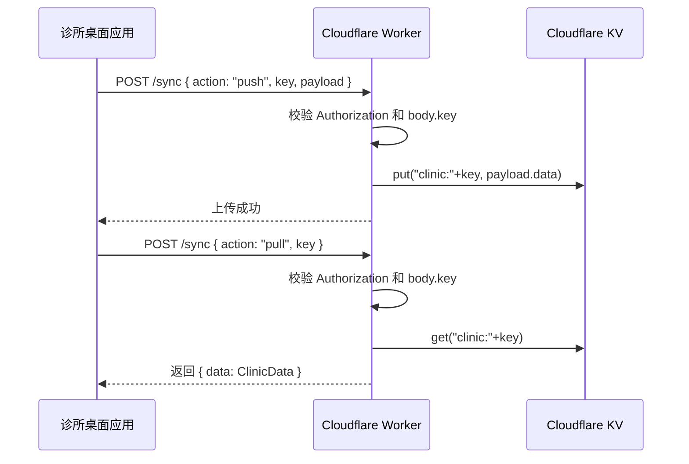

# Cloudflare 免费额度云同步教程

本教程用于把本应用的“云端同步”功能接到 Cloudflare。当前应用的同步协议是全量 JSON 覆盖式同步：前端用同一个接口执行 `pull` 和 `push`，服务器按同步 Key 读取或写入一份完整诊所数据。

## 需要的部件

| 部件 | 用途 | 本教程选择 |
| --- | --- | --- |
| Cloudflare 账号 | 托管 Worker 和 KV | 免费账号即可起步 |
| Workers | 提供 HTTPS API，处理 `pull` / `push` 请求 | 一个 Worker |
| KV Namespace | 保存每个同步 Key 对应的诊所数据 | 一个 KV 命名空间 |
| 同步 Key | 诊所侧的访问凭证，也是 KV 中的数据分区 key | 手动生成一串长随机字符 |
| 应用设置页 | 填写同步接口地址和同步 Key | `设置 -> 通用与数据 -> 云端同步` |
| 本地 JSON 导出 | 上云前的手动兜底备份 | 每次首次接入前先导出 |

Cloudflare 官方文档入口：

- Workers 限制和配额：https://developers.cloudflare.com/workers/platform/limits/
- Workers KV 限制和配额：https://developers.cloudflare.com/kv/platform/limits/

免费额度和限制可能调整，正式上线前以 Cloudflare 官方文档为准。

## 数据流



## 第 1 步：先备份本机数据

在应用里进入：

```text
设置 -> 通用与数据 -> 导出数据 -> 导出 JSON
```

保存导出的 JSON。首次配置云同步前一定先做这一步，因为当前云同步是覆盖式同步，误点“从云端同步”可能用空云端数据覆盖本机数据。

## 第 2 步：创建 KV 命名空间

在 Cloudflare 控制台：

1. 打开 `Workers & Pages`。
2. 进入 `KV`。
3. 创建命名空间，例如：

```text
DENTAL_SYNC
```

记录这个命名空间名称，下一步要绑定到 Worker。

## 第 3 步：创建 Worker

在 Cloudflare 控制台：

1. 打开 `Workers & Pages`。
2. 点击 `Create application`。
3. 选择 `Worker`。
4. 命名，例如：

```text
dental-sync-api
```

创建后会得到一个接口地址，格式类似：

```text
https://dental-sync-api.<your-subdomain>.workers.dev
```

应用设置页里的“同步接口地址”就填这个地址。

## 第 4 步：绑定 KV 到 Worker

进入刚创建的 Worker：

1. 打开 `Settings`。
2. 找到 `Bindings`。
3. 添加 KV namespace binding。
4. 变量名填写：

```text
DENTAL_SYNC
```

5. KV namespace 选择第 2 步创建的 `DENTAL_SYNC`。

Worker 代码会通过 `env.DENTAL_SYNC` 读写 KV。

## 第 5 步：准备同步 Key

生成一串足够长的随机字符串，例如：

```text
clinic_2026_prod_替换成至少32位随机字符
```

要求：

- 不要用诊所名称、手机号、生日等可猜内容。
- 每个诊所使用一个独立 Key。
- 如果怀疑泄露，换一个新 Key，并在应用设置页重新填写。

当前 Worker 示例会同时校验：

- 请求头 `Authorization: Bearer <key>`
- 请求体里的 `key`

这和当前应用的云同步请求格式一致。

## 第 6 步：部署 Worker 代码

把 Worker 代码替换为以下内容：

```js
const APP_NAME = 'DentalClinicManager';
const MAX_BODY_BYTES = 8 * 1024 * 1024;

function json(data, status = 200) {
  return new Response(JSON.stringify(data), {
    status,
    headers: {
      'Content-Type': 'application/json; charset=utf-8',
      'Access-Control-Allow-Origin': '*',
      'Access-Control-Allow-Methods': 'POST, OPTIONS',
      'Access-Control-Allow-Headers': 'Content-Type, Authorization'
    }
  });
}

function getBearerToken(request) {
  const header = request.headers.get('Authorization') || '';
  const match = header.match(/^Bearer\s+(.+)$/i);
  return match ? match[1].trim() : '';
}

function isValidKey(key) {
  return typeof key === 'string' && key.length >= 24 && key.length <= 200;
}

function validateClinicData(data) {
  return Boolean(
    data &&
    typeof data === 'object' &&
    !Array.isArray(data) &&
    data.patients &&
    typeof data.patients === 'object' &&
    data.appointments &&
    typeof data.appointments === 'object' &&
    Array.isArray(data.catalog)
  );
}

export default {
  async fetch(request, env) {
    if (request.method === 'OPTIONS') {
      return json({ ok: true });
    }

    if (request.method !== 'POST') {
      return json({ error: 'Only POST is allowed.' }, 405);
    }

    const contentLength = Number(request.headers.get('Content-Length') || 0);
    if (contentLength > MAX_BODY_BYTES) {
      return json({ error: 'Payload is too large.' }, 413);
    }

    let body;
    try {
      body = await request.json();
    } catch {
      return json({ error: 'Invalid JSON body.' }, 400);
    }

    if (body?.app !== APP_NAME) {
      return json({ error: 'Invalid app name.' }, 400);
    }

    const key = typeof body.key === 'string' ? body.key.trim() : '';
    const token = getBearerToken(request);
    if (!isValidKey(key) || token !== key) {
      return json({ error: 'Unauthorized.' }, 401);
    }

    const storageKey = `clinic:${key}`;

    if (body.action === 'pull') {
      const stored = await env.DENTAL_SYNC.get(storageKey, 'json');
      if (!stored) {
        return json({ error: 'No cloud data found for this key.' }, 404);
      }
      return json({ data: stored.data || stored });
    }

    if (body.action === 'push') {
      const clinicData = body.payload?.data || body.payload;
      if (!validateClinicData(clinicData)) {
        return json({ error: 'Invalid clinic data.' }, 400);
      }

      await env.DENTAL_SYNC.put(storageKey, JSON.stringify({
        app: APP_NAME,
        updatedAt: new Date().toISOString(),
        data: clinicData
      }));

      return json({ ok: true, message: 'Cloud data saved.' });
    }

    return json({ error: 'Unknown action.' }, 400);
  }
};
```

保存并部署。

## 第 7 步：在应用里配置同步

进入应用：

```text
设置 -> 通用与数据 -> 云端同步
```

填写：

```text
同步接口地址：https://dental-sync-api.<your-subdomain>.workers.dev
同步 Key：第 5 步生成的随机 Key
```

点击：

```text
保存同步配置
```

## 第 8 步：首次上传本机数据

首次接入时推荐顺序：

1. 先导出 JSON 备份。
2. 确认本机数据是最新数据。
3. 点击 `上传本机数据`。
4. 看到“本机数据已上传到云端。”后，再到另一台设备测试拉取。

不要在空白新设备上先点“从云端同步”，除非已经确认云端有数据。

## 第 9 步：第二台设备拉取

在第二台设备安装应用后：

1. 打开设置页。
2. 填入同一个同步接口地址。
3. 填入同一个同步 Key。
4. 点击 `从云端同步`。
5. 确认数据已出现。

## 第 10 步：日常使用规则

当前同步是整包覆盖，不是多人实时协作。建议按以下规则使用：

- 一台设备改完数据后，点击 `上传本机数据`。
- 另一台设备开始使用前，先点击 `从云端同步`。
- 不要让两台设备同时录入不同数据后互相覆盖。
- 每天结束营业后仍建议导出一份 JSON。

## 故障排查

| 现象 | 常见原因 | 处理 |
| --- | --- | --- |
| `Unauthorized` | 同步 Key 不一致，或请求头 token 与 body key 不一致 | 重新复制同一个 Key 到应用设置页 |
| `No cloud data found for this key` | 还没有上传过数据 | 先在主设备点击 `上传本机数据` |
| `Invalid clinic data` | 上传 payload 不是应用数据结构 | 确认使用应用内云同步按钮，不要手动发错 JSON |
| CORS 报错 | Worker 没有返回跨域头 | 使用本教程里的 `json()` 响应函数 |
| 上传失败或超时 | 数据过大、网络不稳定、KV 写入失败 | 先导出 JSON，本地保留备份后重试 |

## 后续增强方向

当前方案可以低成本跑通云端备份和设备间同步，但还没有冲突处理。后续建议：

1. 为患者、预约、处置补齐 `updatedAt`。
2. Worker 保存 `updatedAt`、`deviceId` 和版本号。
3. 应用拉取前先做云端差异预览。
4. 对“本机较新”和“云端较新”的记录分别提示处理方式。
5. 重要诊所数据建议从 KV 逐步升级到 D1 或 R2 备份版本保留。
